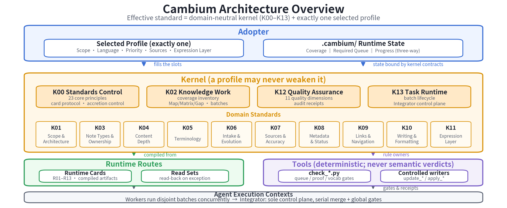

# Cambium

English | [简体中文](README.zh-CN.md)

Cambium is a governance standard and reference toolset for knowledge
repositories maintained with LLM agents.

It helps an operator answer five practical questions:

1. What rules apply to this repository?
2. What work is required, and who may change shared state?
3. What evidence must exist before work can close?
4. How can an interrupted task resume without guessing?
5. Which decisions belong to the operator rather than the agent?

Cambium is not a knowledge base, a RAG engine, an agent scheduler, or a default
domain policy. It governs work; it does not supply the corpus or decide its
meaning.

## Start Here

- To understand the model, read [The Mental Model](#the-mental-model).
- To adopt Cambium for a repository, follow [Adopt Cambium](#adopt-cambium).
- To resume existing work, run the command in
  [Start Or Resume A Task](#start-or-resume-a-task) before writing anything.
- To connect an agent host, see
  [Use Cambium From An Agent Host](#use-cambium-from-an-agent-host).
- For every tool and its exact arguments, see [Tools/README.md](Tools/README.md).
- For what is complete, in progress, or only conditional, see
  [ROADMAP.md](ROADMAP.md).

## The Mental Model

```text
effective governance
  = Cambium kernel
  + exactly one selected profile
  + adopter-owned runtime state
```

The diagram shows how these layers connect to runtime routes, deterministic
tools, and agent execution contexts.



| Layer | What it owns |
|---|---|
| `kernel/` | Cross-domain rules, gates, routes, Read Sets, and Runtime Cards |
| Selected profile | One repository's scope, language, architecture, sources, priorities, roles, scans, and allowed extensions |
| `.cambium/` | The adopter's current governance identity, task state, Queue, plans, deltas, receipts, and recovery evidence |
| `Tools/` | Deterministic checks, controlled writers, schemas, and generated projections |

The kernel is normative. A profile can fill or tighten an extension point, but
cannot disable a kernel rule. Tools execute declared rules; they do not make
the final semantic judgment.

Runtime Cards are short execution routes, not a second copy of the standard.
When a Card is insufficient or disputed, its Read Set leads back to the
normative kernel text.

This repository is intentionally uninstantiated. It contains templates and
examples, but selects no adopter profile and creates no fabricated task state.

## What Ships Today

Cambium currently provides:

- a single pre-closed profile template, a safe scaffolder, a machine-readable
  adoption interview, a read-only onboarding status view, and profile checks;
- persistent Coverage, Required Queue, and Progress state for resumable work;
- deterministic task and batch transitions, controlled Amendments, active-task
  Standards adoption, interruption recovery, and build or maintenance closure;
- append-only receipts and Terminal Proof bindings;
- explicit Global Map, Capability Matrix, and Gap Register validation;
- deterministic page, structure, vocabulary, link, boundary, freshness, and
  residual-content checks;
- a generated host-neutral interface: each tool's own CLI declaration and the
  closed agent-interface capability policy compile into the agent-facing MCP
  projection and per-host configuration; every active caller-visible path is
  retained as a descriptor capability through subprocess consumption;
- Card-first activation and progressive Read Set delivery primitives.

The generated MCP surface is a call surface, not an orchestrator. The tools
still decide whether an operation is valid and whether its evidence counts.
For every typed path whose compiled operation-mode predicate is active,
including an effective CLI default, the transport retains the admitted file
or parent directory descriptor and the shared tool
I/O layer consumes that same object for snapshot, append, replacement, or
transaction access. A nested Cambium subprocess inherits the same capability;
distinct active arguments may not alias one path under the same consumption
mode because that would make consumption identity ambiguous. An unsupported
platform fails server initialization instead of claiming this assurance.

## What Does Not Ship Yet

Cambium does not currently bundle:

- agent dispatch or scheduling;
- isolated worker workspaces;
- a complete single-writer integrator loop;
- durable Assignment lifecycle management;
- authenticated actor or reviewer identity;
- protected whole-workspace execution against arbitrary concurrent mutation;
- automatic corpus-wide dependency propagation;
- an independent evaluator that re-derives the complete expected corpus;
- an installable OpenAI Plugin package, Hooks, UI, or marketplace entry.

These boundaries are intentional. A host may add capabilities, but it must not
claim evidence for a capability it cannot prove. See [ROADMAP.md](ROADMAP.md)
for the delivery order.

## The Three Runtime Ledgers

Long-running work uses three state objects with different owners:

| State object | What it answers |
|---|---|
| Coverage Ledger | Which knowledge objects exist, what disposition they have, and which batch currently owns unfinished work? |
| Required Queue | Which batches exist, what are their manifests and dependencies, and what lifecycle state is each batch in? |
| Progress Ledger | What is the task contract, whole-task state, checkpoint, Standards identity, and accepted Queue fingerprint? |

They must agree, but they are not interchangeable task lists.

The adopter-owned namespace is:

```text
.cambium/
├── governance/  # current Standards and selected-profile identity
├── state/       # Coverage, Required Queue, and Progress
├── work_specs/  # immutable contracts for complex batches
├── deltas/      # proposed and batch-local changes
├── receipts/    # evidence and transition history
├── reports/     # derived views; never authority
└── tmp/         # locks and interrupted-write recovery evidence
```

Do not edit canonical state by hand. Use the owning writer so revisions,
hashes, receipts, and recovery evidence move together.

## Adopt Cambium

Adoption creates and approves one profile for one repository. Copying a
template or example does not select it.

### 1. Create a candidate profile

```text
python3 Tools/scaffold_profile.py . --profile-id my-profile
python3 Tools/scaffold_profile.py . --profile-id my-profile --apply
```

The first command is a dry run. The second copies only the version-controlled
whitelist and refuses to overwrite an existing candidate.

### 2. Answer the open decisions and validate

Use [profiles/interview.yaml](profiles/interview.yaml) with an assisting agent,
or fill the same contract by hand. The authoritative slot guide is
[profiles/README.md](profiles/README.md).

```text
python3 Tools/profile_onboarding_status.py . --profile-id my-profile --json
python3 Tools/check_profile.py profiles/my-profile
```

The template pre-closes choices that have a safe legal default. The remaining
questions require operator-confirmed repository decisions. An agent may prepare
a candidate, but may not approve it or invent domain policy.

### 3. Approve the profile through R09

Prepare a plan from
[Tools/schemas/profile_adoption_plan.template.yaml](Tools/schemas/profile_adoption_plan.template.yaml),
then dry-run and apply it:

```text
python3 Tools/apply_profile_adoption.py . --plan <plan>.yaml
python3 Tools/apply_profile_adoption.py . --plan <plan>.yaml --apply
```

The transaction binds the approved Standards version, selected profile,
generated contracts, Runtime Cards, and adoption receipts. It restores the
previous control plane if any step fails.

An empty corpus follows the same adoption contract. First perform bounded
founding work to create real canonical owners and the residual-scan witness —
one page may serve as both owner and witness when that is semantically
natural, but pages are never merged only to save files. Then a second R09
revision configures the Corpus Planning slot before large-scale work begins.
The exact sequence is documented in
[profiles/README.md](profiles/README.md#adoption-flow).

## Start Or Resume A Task

Always check for existing runtime state before writing:

```text
python3 Tools/check_queue.py . --resume-status
```

If `.cambium/state/` exists, this command reports the recorded task, locks,
holds, in-flight batches, recovery state, and exact `next_action`. Do not
initialize over it.

Bounded work does not need empty persistent state. For long-running, resumable,
or multi-batch work, initialize once after profile adoption:

```text
python3 Tools/init_state.py . \
  --task-id YOUR_TASK \
  --objective "State the concrete outcome" \
  --exclude "State one explicit boundary" \
  --completion-semantics build \
  --scope-version s1 \
  --standards-version YOUR_VERSION \
  --profile-manifest profiles/my-profile/profile.md
```

Review the dry run, then repeat the command with `--apply`.

`init_state.py` deliberately leaves work selection empty. Put the confirmed
Task Contract and Coverage choices in one task plan, then materialize the Queue:

```text
cp Tools/schemas/task_plan.template.yaml \
  .cambium/deltas/task-plans/TP-001.yaml

python3 Tools/apply_task_plan.py . \
  --plan .cambium/deltas/task-plans/TP-001.yaml

python3 Tools/apply_task_plan.py . \
  --plan .cambium/deltas/task-plans/TP-001.yaml --apply

# Use the revision and SHA printed by apply_task_plan.py.
python3 Tools/compile_queue.py . --apply --actor-role integrator \
  --expected-queue-revision REVISION \
  --expected-sha256 SHA256

python3 Tools/check_queue.py .
python3 Tools/render_queue.py .
```

Use `build` when the task closes through Terminal Proof. Use `maintenance`
when it closes through the bounded maintenance gate. The choice is frozen in
the Task Contract.

## Controlled Changes

After the Queue exists, shared state changes go through a controlled writer:

- `register_amendment.py` and `apply_amendment.py` handle approved operational
  replans such as bounded scope/disposition changes and batch cancellation;
- `apply_contract_amendment.py` handles the two supported Task Contract fields:
  `policy_exceptions` and `amendment_authority`;
- `adopt_standards.py` moves an active task to an approved Standards/Profile
  revision without rewriting its lifecycle history;
- `apply_delta.py`, `update_queue.py`, and `update_task.py` own batch and task
  progression.

Writers are dry runs unless `--apply` is present. Shared-state writes are
integrator-only and require current revisions or hashes where the tool asks for
them. Exact commands, schemas, and recovery procedures are in
[Tools/README.md](Tools/README.md).

## Use Cambium From An Agent Host

Cambium renders registration and corpus binding for Claude Code, Codex, Kimi
Code, and dsh from one canonical server definition:

```bash
python3 Tools/render_host_configs.py . \
  --distribution-root /absolute/path/to/cambium \
  --workspace-root /absolute/path/to/corpus

python3 Tools/render_host_configs.py . \
  --distribution-root /absolute/path/to/cambium \
  --workspace-root /absolute/path/to/corpus \
  --check
```

Generated files land under `Tools/compiled/host-configs/`.

| Host | Install the generated configuration at |
|---|---|
| Claude Code | `<corpus>/.mcp.json` |
| Codex | `<corpus>/.codex/config.toml` |
| Kimi Code | `<corpus>/.kimi-code/mcp.json` |
| dsh | the operator profile for registration and `<corpus>/.env` for binding |

Registration answers “where is the server?” Corpus binding answers “which
repository does this session govern?” They are separate capabilities.

Installing a host configuration is not Cambium adoption. It does not approve a
profile, create task state, or migrate Standards. The MCP server exposes the
generated CLI projection and passes tool verdicts through; it does not create a
second policy engine.

Card delivery also has a strict evidence boundary. A server can prove what it
sent, but not by itself what a host placed in the model context or what an agent
read. Machine-enforced Assignment delivery remains an in-progress roadmap
capability; until its gate is complete, do not turn transport metadata into a
claim of cognition or independent execution.

## Safety And Trust Boundary

- A surviving writer lock is recovery evidence. Do not delete it until the
  writer, state files, receipts, pending deltas, and archive moves are
  reconciled.
- JSONL receipts are append-only. An uncertain append keeps the lock rather
  than guessing whether the receipt landed.
- Exit code `2` is a hold, not success and not an ordinary failure.
- Reports and generated projections are views, never canonical input.
- Repository-provided verifier code is not run automatically; its source and
  effects require explicit authorization.

SHA-256 bindings detect drift and inconsistent history inside the adopter's
local trust domain. They are not signatures. Without a protected runner or
external attestation, Cambium does not authenticate actor labels, reviewer
labels, operating-system identities, or workspace isolation. A party that can
rewrite the repository, tools, and evidence can construct a new internally
consistent history. The MCP transport rejects unsafe arguments and static path
aliases inside this local trust domain. For every caller-visible typed path,
it also prevents a post-admission name or parent replacement from redirecting
the child tool: the exact admitted object is retained and consumed. This is
not protected whole-workspace execution. A concurrently privileged process
can still attack fixed or derived internal paths that are not part of the
public call surface, rewrite repository code and evidence together, or
interfere outside the filesystem capability boundary; those wider guarantees
require an isolated workspace or external trust anchor.

## Repository Map

| Path | Purpose |
|---|---|
| [`kernel/`](kernel/) | Normative standards, Read Sets, and Runtime Cards |
| [`profiles/`](profiles/) | Profile interface, template, interview, and examples |
| [`Tools/`](Tools/) | Checks, writers, schemas, receipts, and generators |
| [`Tools/compiled/`](Tools/compiled/) | Generated CLI, MCP, metadata, and host projections |
| [`assets/readme/`](assets/readme/) | Public diagrams embedded by the root READMEs |
| [`ROADMAP.md`](ROADMAP.md) | Status-based implementation roadmap |
| [`CONTRIBUTING.md`](CONTRIBUTING.md) | Issue ownership, defect promotion, and pull-request contract |

Examples show answer shape; they are not defaults and must not be selected in
place of an adopter-owned profile.

## License

Cambium uses path-based licensing:

- software and implementation material under `Tools/` uses Apache-2.0;
- standards, profiles, README files, roadmap documentation, and diagrams under
  `assets/readme/` use CC BY 4.0.

See [LICENSE.md](LICENSE.md), [ATTRIBUTION.md](ATTRIBUTION.md), and
[LICENSES/](LICENSES/) for the authoritative terms and notices.

Adopter-generated profiles, state, receipts, and evidence do not acquire a
Cambium license merely because Cambium tools manage them.
