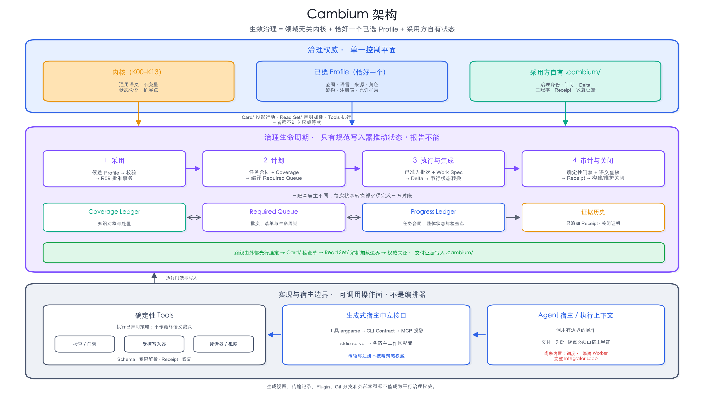

# Cambium

[English](README.md) | 简体中文

Cambium 是一套治理标准和参考工具，适用于由 LLM Agent 参与维护的知识仓库。

它主要帮助操作者回答五个实际问题：

1. 这个仓库要遵守哪些规则？
2. 当前必须做什么，谁可以修改共享状态？
3. 一项工作结束前，必须留下哪些证据？
4. 任务中断后，新的 Agent 如何在不猜测的情况下继续？
5. 哪些决定必须由操作者做，不能交给 Agent 自行判断？

Cambium 不是知识库、RAG 引擎、Agent 调度器，也不提供默认的领域政策。它治理工作过程，但不提供知识内容，也不替操作者决定内容含义。

## 建议从这里开始

- 想先理解 Cambium：阅读[理解 Cambium](#理解-cambium)。
- 想在一个仓库中采用 Cambium：按照[采用 Cambium](#采用-cambium)操作。
- 想继续一项已有任务：写入任何内容前，先运行 [开始或恢复任务](#开始或恢复任务)中的检查命令。
- 想从 Agent 宿主调用 Cambium：阅读 [从 Agent 宿主调用 Cambium](#从-agent-宿主调用-cambium)。
- 想查看所有工具及其准确参数：阅读 [Tools/README.md](Tools/README.md)。
- 想了解哪些能力已经完成、正在开发或有条件可用：阅读 [ROADMAP.zh-CN.md](ROADMAP.zh-CN.md)。

## 理解 Cambium

Cambium 的有效治理由三部分组成：

```text
有效治理
  = Cambium 内核
  + 唯一一个已选定的 Profile
  + 采用方自己拥有的运行时状态
```

下图展示了这些层如何连接运行时路由、确定性工具和 Agent 执行上下文。



| 层 | 负责什么 |
|---|---|
| `kernel/` | 跨领域治理语义、不变量、状态含义与扩展点 |
| `Card/` | 面向已经选定的任务路线或阶段、经过人工策划的非权威飞行检查单 |
| `Read Set/` | 声明已经选定的路线或阶段必须加载哪些权威内容的机器可解析边界 |
| 已选定的 Profile | 一个仓库自己的范围、语言、架构、来源、优先级、角色、扫描规则和允许的扩展 |
| `.cambium/` | 采用方当前的治理身份、任务状态、Queue、计划、变更、receipt 和恢复证据 |
| `Tools/` | 确定性检查、受控写入器、schema 和生成产物 |

内核是规范性来源。Profile 可以填写或收紧内核预留的扩展点，但不能关闭内核规则。工具按照已声明的规则执行检查和写入，但不替操作者做最终的语义判断。

Card 是经过人工策划的简短检查单，不是路线本身，也不是规范的第二份副本。Read Set 拥有静态加载边界。当 Card 的信息不够，或其提示存在争议时，Agent 应通过配对的 Read Set 回到真正的权威来源。

本仓库有意保持“尚未采用”的状态：它提供一份候选 Profile 模板和非权威示例，但没有替任何采用方选择 Profile，也没有伪造任务状态。

## 目前已经提供的能力

Cambium 当前提供：

- 一份默认关闭可选项的 Profile 模板、安全的 Profile 脚手架、机器可读的采用访谈、只读的入门状态检查和 Profile 校验；
- 可持久保存的 Coverage、Required Queue 和 Progress 状态，使长期任务能够恢复；
- 确定性的任务与批次状态转换、受控 Amendment、活动任务的 Standards 采用、中断恢复，以及 build 或 maintenance 两种完成路径；
- 只追加的 receipt 和 Terminal Proof 绑定；
- 对 Global Map、Capability Matrix 和 Gap Register 的显式校验；
- 确定性的页面、结构、词汇、链接、边界、新鲜度和残留内容检查；
- 宿主无关的生成接口：每个工具自己的 CLI 声明会编译成面向 Agent 的 MCP 接口，并生成各宿主所需的配置；每一个实际生效、由调用者可见的路径都会以文件描述符能力一直保留到子进程真正消费；
- Card-first activation，以及逐步交付 Read Set 的基础能力。

生成的 MCP 接口只是调用入口，不是任务编排器。一次操作是否有效、它的证据是否成立，仍由工具判断。对每一个经编译后的操作模式谓词判定为生效的类型化路径（包括 CLI 默认值），传输层会保留准入时的文件或父目录对象，工具共享 I/O 层再以 snapshot、append、replace 或 transaction 模式消费同一个对象；嵌套的 Cambium 子进程也会继承这份能力。两个不同的活动参数不得以同一种消费模式指向同一路径，因为那会混淆“哪个参数已被消费”的身份。不支持这种无跟随描述符边界的平台会拒绝启动，而不是降级后仍宣称已经提供该保证。

## 目前还没有提供的能力

Cambium 当前不包含：

- Agent 派发或调度；
- 隔离的执行者工作区；
- 完整的 single-writer integrator 循环；
- 持久、完整的 Assignment 生命周期管理；
- 经过认证的操作者或审阅者身份；
- 面对任意并发修改的、受保护的完整工作区执行环境；
- 自动的全语料库依赖传播；
- 能独立重新推导完整预期语料库的评估器；
- 可安装的 OpenAI Plugin 包、Hooks、UI 或应用市场条目。

这些边界是有意保留的。宿主可以补充额外能力，但不能为自己无法证明的能力声明证据。具体交付顺序见 [ROADMAP.zh-CN.md](ROADMAP.zh-CN.md)。

## 三本运行时台账

长期任务使用三个职责不同的状态对象：

| 状态对象 | 它回答的问题 |
|---|---|
| Coverage Ledger | 有哪些知识对象？它们如何处置？未完成工作当前由哪个批次负责？ |
| Required Queue | 有哪些批次？每个批次的清单、依赖和生命周期状态是什么？ |
| Progress Ledger | 任务合同、整体状态、检查点、Standards 身份和已接受的 Queue 指纹是什么？ |

三者必须相互一致，但不能把它们当成三份可以互换的任务列表。

采用方拥有的运行状态分为六类：

```text
.cambium/
├── <当前权威状态>
├── <已绑定的运行输入>
├── <证据与历史>
├── <恢复状态>
├── <临时工作空间>
└── <派生投影>
```

不要手工修改权威状态。应使用拥有该状态的写入器，让 revision、hash、receipt 和恢复证据一起更新。当前物理路径与对象分类只由 [`Tools/runtime_paths.py`](Tools/runtime_paths.py) 这一份机器合同维护；README 不再保留第二份目录结构定义。

## 采用 Cambium

采用过程的目标，是为一个仓库创建并批准唯一一个 Profile。复制模板或示例并不等于选定 Profile。

### 1. 创建候选 Profile

```text
python3 Tools/scaffold_profile.py . --profile-id my-profile
python3 Tools/scaffold_profile.py . --profile-id my-profile --apply
```

第一条命令只预览，不写文件。第二条命令只复制版本控制白名单中的文件；如果目标已经存在，它会拒绝覆盖。

### 2. 回答开放问题并校验

可以让 Agent 按 [profiles/interview.yaml](profiles/interview.yaml) 协助访谈，也可以手工填写同一份合同。通用 slot 接口属于 Kernel，由 [K00/19](kernel/K00%20Standards%20Control/19%20Profile%20Extension%20Interface.md) 及其机器注册表定义；[profiles/README.md](profiles/README.md) 只说明候选 Profile 的操作流程。

```text
python3 Tools/profile_onboarding_status.py . --profile-id my-profile --json
python3 Tools/check_profile.py profiles/my-profile
```

模板已经预先关闭有安全默认值的选项。剩余问题都需要操作者确认仓库的真实情况。 Agent 可以准备候选答案，但不能批准 Profile，也不能自行发明领域政策。

### 3. 通过 R09 批准 Profile

以 [Tools/schemas/profile_adoption_plan.template.yaml](Tools/schemas/profile_adoption_plan.template.yaml) 为模板准备采用计划，然后先预览，再正式应用：

```text
python3 Tools/apply_profile_adoption.py . --plan <plan>.yaml \
  --upstream-root <本地-Cambium-仓库> --upstream-ref <git-ref>
python3 Tools/apply_profile_adoption.py . --plan <plan>.yaml \
  --upstream-root <本地-Cambium-仓库> --upstream-ref <git-ref> --apply
```

这个事务会把上游 ref 解析为完整 Git commit SHA，并绑定所选 Profile、采用者自己的生成合同和证据；任何一步失败，工具都会恢复之前的控制面。它不会重新 stamp 或改写采用者持有的上游 Card 字节；`standards_version` 只保留为该 commit 的兼容字段。采用仍是明确的 CLI 维护操作：其外部上游仓库输入不会作为不受约束的 MCP 参数暴露给 Agent。

空语料库也使用同一份采用合同。先进行有界的 founding 工作，创建真实的 canonical owner 和残留扫描见证——语义自然时一页可以同时充当 owner 和见证，但绝不为了少建文件而强行合并；随后由第二次 R09 修订配置 Corpus Planning，之后才能开始大规模工作。候选 Profile 与采用边界见 [profiles/README.md](profiles/README.md#mechanical-validation-and-adoption)。

## 开始或恢复任务

写入任何内容前，先检查仓库是否已经存在运行时状态：

```text
python3 Tools/check_queue.py . --resume-status
```

如果 `.cambium/state/` 已经存在，这条命令会报告已记录的任务、锁、hold、正在执行的批次、恢复状态和准确的 `next_action`。不要在已有状态之上重新初始化。

有界工作不要求创建空的持久状态。长期、可恢复或多批次任务，应在 Profile 采用后只初始化一次：

```text
python3 Tools/init_state.py . \
  --task-id YOUR_TASK \
  --objective "写明要得到的具体结果" \
  --exclude "写明至少一项明确边界" \
  --completion-semantics build \
  --scope-version s1 \
  --standards-version APPROVED_UPSTREAM_COMMIT_SHA \
  --profile-manifest profiles/my-profile/profile.md
```

`APPROVED_UPSTREAM_COMMIT_SHA` 应读取当前 `.cambium/governance/standards_state.yaml` 中的完整上游 commit SHA，而不是 `X.Y.Z` 之类的发布标签。

先检查预览结果，再加上 `--apply` 重复运行。

`init_state.py` 不会替你选择工作。把已确认的 Task Contract 和 Coverage 选择写入同一份任务计划，再生成 Queue：

```text
cp Tools/schemas/task_plan.template.yaml \
  .cambium/deltas/task-plans/TP-001.yaml

python3 Tools/apply_task_plan.py . \
  --plan .cambium/deltas/task-plans/TP-001.yaml

python3 Tools/apply_task_plan.py . \
  --plan .cambium/deltas/task-plans/TP-001.yaml --apply

# 使用 apply_task_plan.py 输出的 revision 和 SHA。
python3 Tools/compile_queue.py . --apply --actor-role integrator \
  --expected-queue-revision REVISION \
  --expected-sha256 SHA256

python3 Tools/check_queue.py .
python3 Tools/render_queue.py .
```

需要 Terminal Proof 才能关闭的任务使用 `build`；通过有界 maintenance 门禁关闭的任务使用 `maintenance`。这个选择会冻结在 Task Contract 中。

## 受控变更

Queue 生成后，共享状态必须通过对应的受控写入器修改：

- `register_amendment.py` 和 `apply_amendment.py`：处理已批准的运营调整，例如有界的范围或处置变化，以及取消批次；
- `apply_contract_amendment.py`：修改目前支持的两个 Task Contract 字段： `policy_exceptions` 和 `amendment_authority`；
- `adopt_standards.py`：让活动任务采用已批准的新 Standards/Profile 版本，同时保留原有生命周期历史；
- `apply_delta.py`、`update_queue.py` 和 `update_task.py`：负责批次与任务推进。

除非带有 `--apply`，这些写入器都只预览。共享状态写入只允许 integrator 执行；工具要求 revision 或 hash 时，必须提供当前值。准确命令、schema 和恢复步骤见 [Tools/README.md](Tools/README.md)。

## 从 Agent 宿主调用 Cambium

Cambium 从一份权威 server 定义，为 Claude Code、Codex、Kimi Code 和 dsh 生成注册配置和语料库绑定：

```bash
python3 Tools/render_host_configs.py . \
  --projection-target carried-runtime \
  --output-dir /语料库/的绝对路径/.host-config-staging \
  --distribution-root /语料库/的绝对路径 \
  --workspace-root /语料库/的绝对路径

python3 Tools/render_host_configs.py . \
  --projection-target carried-runtime \
  --output-dir /语料库/的绝对路径/.host-config-staging \
  --distribution-root /语料库/的绝对路径 \
  --workspace-root /语料库/的绝对路径 \
  --check
```

请在 adopted corpus 根目录、完成 carried interface 生成后运行。绑定产品写入 `.host-config-staging/`，再通过对应宿主自己的机制安装。`Tools/compiled/host-configs/` 只保留 source-distribution 模板，由 Cambium 维护流程生成或检查。

| 宿主 | 生成配置应安装到 |
|---|---|
| Claude Code | `<corpus>/.mcp.json` |
| Codex | `<corpus>/.codex/config.toml` |
| Kimi Code | `<corpus>/.kimi-code/mcp.json` |
| dsh | 用操作者 Profile 注册，用 `<corpus>/.env` 绑定语料库 |

“注册”回答 server 在哪里；“语料库绑定”回答当前会话治理哪个仓库。它们是两种不同的能力。

安装宿主配置不等于采用 Cambium：它不会批准 Profile、创建任务状态或迁移 Standards。MCP server 只暴露生成的 CLI 接口并原样传递工具结论，不会创建第二套政策引擎。

Card 交付也有严格的证据边界。server 可以证明自己发送了什么，但不能单独证明宿主把什么放入模型上下文，也不能证明 Agent 读过什么。机器强制的 Assignment 交付仍是路线图中的开发中能力；完整门禁完成前，不能把传输元数据写成“已经理解”或“已经独立执行”的证据。

## 安全和信任边界

- 遗留的写入器锁是恢复证据。在核对写入器、状态文件、receipt、待处理 delta 和归档移动之前，不要删除它。
- JSONL receipt 只能追加。如果不确定一次追加是否成功，应保留锁，不要猜测。
- 退出码 `2` 表示 hold，既不是成功，也不是普通失败。
- report 和生成投影只是视图，不能作为权威输入。
- 仓库提供的 verifier 代码不会自动运行；运行前必须明确授权并检查其源码和影响。
- 上游组件字节比较必须从独立可信的上游 checkout（或受保护 runner）运行，并把 adopter 作为被检查目标。它用于发现漂移，不能让 adopter 内尚未校验的 Tool 自证可信。

SHA-256 绑定可以在采用方的本地信任域中发现漂移和不一致历史，但它不是数字签名。没有受保护 runner 或外部证明时，Cambium 无法认证 actor/reviewer 标签、操作系统身份或工作区隔离是否真实。能够同时改写仓库、工具和证据的一方，也能构造一套新的、内部自洽的历史。对公共调用面上的每一个类型化路径，MCP 传输层会把准入时的文件或父目录对象一直保留到工具实际消费，因此准入后的路径名或父目录替换不能把读写重定向到另一个对象。但这不等于整个工作区已经隔离：拥有并发写权限的一方仍可能攻击没有出现在公共调用面上的固定或派生内部路径，或同时改写工具与证据。这些更宽的保证仍需要隔离工作区或外部信任锚。

## 仓库结构

| 路径 | 用途 |
|---|---|
| [`kernel/`](kernel/) | 通用治理规则与 Kernel-owned 机器合同 |
| [`Card/`](Card/) | 经过人工策划的非权威行动检查单 |
| [`Read Set/`](Read%20Set/) | 权威静态加载声明与生成导航 |
| [`profiles/`](profiles/) | 候选模板、访谈、采用说明与非权威示例 |
| [`Tools/`](Tools/) | 检查、写入器、schema、receipt 和生成器 |
| [`Tools/compiled/`](Tools/compiled/) | 生成的 CLI、MCP、元数据和宿主投影 |
| [`assets/readme/`](assets/readme/) | 根目录双语 README 使用的公共结构图 |
| [`ROADMAP.zh-CN.md`](ROADMAP.zh-CN.md) | 按状态组织的实现路线图 |

Kernel 模块编号是稳定身份，不是必须连续的展示序号。模块迁出或退役后，其编号不再复用；当前阅读顺序以各标准入口页列出的 Module Index 为准。

示例只说明答案应写成什么形式，不是默认配置，也不能代替采用方自己拥有的 Profile。

## 许可证

Cambium 按路径使用不同许可证：

- `Tools/`、`.github/`、`Makefile` 与 `distribution-boundary.yaml` 中的软件和仓库工程材料使用 Apache-2.0；
- `kernel/` 下的标准、`Card/`、`Read Set/`、Profile、README、贡献说明、路线图和 `assets/readme/` 下的结构图使用 CC BY 4.0。

权威条款和声明见 [LICENSE.md](LICENSE.md)、[ATTRIBUTION.md](ATTRIBUTION.md) 和 [LICENSES/](LICENSES/)。

采用方生成的 Profile、状态、receipt 和证据，不会因为由 Cambium 工具管理而自动获得 Cambium 的许可证。
